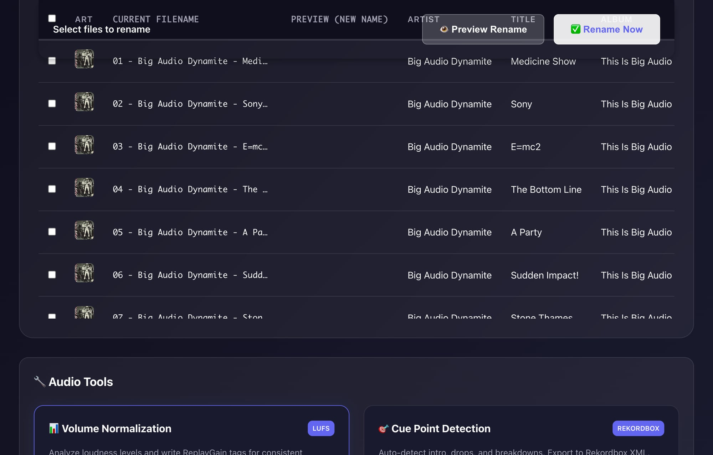
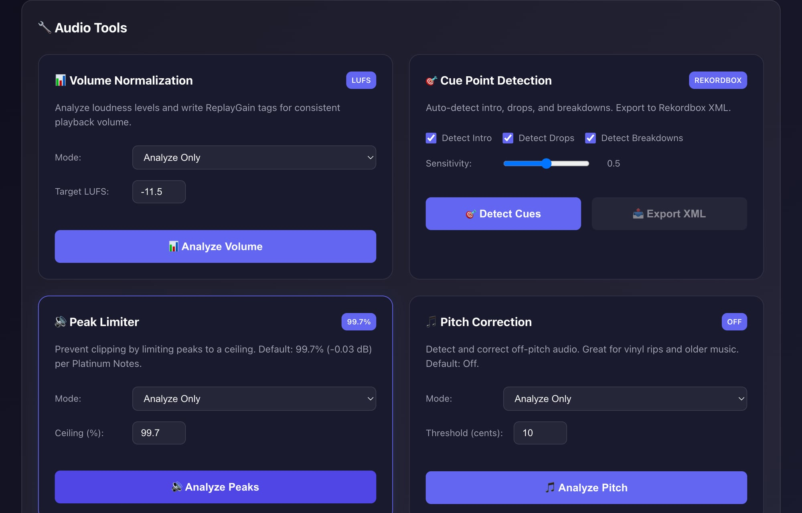

# 📦 Crate

**The DJ's Indestructible Library Tool**

[](https://github.com/zenone/crate)
[](https://python.org)
[](https://github.com/zenone/crate)
[](LICENSE)

A **DJ-first audio library tool** designed for real-world workflows:

- **Rekordbox** / **Pioneer CDJ-3000** / **XDJ gear**
- USB export + Finder browsing
- Long-term library hygiene and portability

---

## ✨ Features

### 🎵 Smart Renaming

```
Artist - Track Title (Extended Mix) [8A 128].mp3
01 Artist - Track Title.mp3
```

- **Artist - Title first** → fastest scanning on CDJs & USBs
- **Camelot Key + BPM** for instant mix context
- **Track numbers preserved** for albums/EPs

### 📊 Volume Normalization

- **LUFS measurement** (EBU R128 / ITU-R BS.1770)
- **ReplayGain tag writing** (non-destructive)
- **Target: -11.5 LUFS** (DJ standard per Platinum Notes)

### 🎯 Cue Point Detection

- **Intro detection** — First beat marker
- **Drop detection** — Energy peaks
- **Breakdown detection** — Energy dips
- **Rekordbox XML export** — Ready for import

### 🔊 Peak Limiter

- **True peak limiting** to prevent clipping
- **Default ceiling: 99.7%** (-0.03 dB per Platinum Notes)
- Protects audio on club PA systems

### 🎵 Pitch Correction

- **Pitch deviation detection** from nearest semitone
- **High-quality pitch shifting** via rubberband
- **Default: Off** (10 cent threshold when enabled)
- Great for vinyl rips and older music

### 🔧 Clipped Peak Repair

- **Detects digital clipping** (flat-topped waveforms)
- **Cubic spline interpolation** to reconstruct natural peaks
- **Per-channel processing** for stereo audio
- **Default: Off** — preserves original audio unless needed

### 🌡️ Warmth / Saturation

- **Analog-style harmonic saturation** via tanh soft clipping
- **Exciter effect** with high-frequency enhancement
- **Adjustable drive, mix, and tone** controls
- **Default: Off** — adds subtle vinyl warmth when enabled

### 🔍 Audio Analysis

- **BPM/Key detection** via Essentia or librosa
- **MusicBrainz/AcoustID lookup** for metadata
- Deep ID3 tag reading (Rekordbox/Serato custom tags)

---

## 🚀 Quick Start

### Install

```bash
git clone https://github.com/zenone/crate.git
cd crate
pip install -e .
```

### Web Interface (Recommended)

```bash
./crate-web.sh --no-https
# Open http://127.0.0.1:8000
```

### CLI (Preview Mode)

```bash
# Shows what WOULD change (no actual changes)
crate ~/Music/Incoming --dry-run -v
```

---

## 💻 Web Interface

The modern Web UI provides a complete DJ workflow:

### Directory Browser & File Table



- **Album art display** with metadata from ID3 tags
- **BPM, Key, Duration, Genre** columns
- **Search and sort** by any column
- **Multi-file selection** for batch operations

### Audio Tools Panel



Six powerful audio processing tools:

| Tool | Badge | Description |
|------|-------|-------------|
| **Volume Normalization** | `LUFS` | Analyze loudness, write ReplayGain tags |
| **Cue Point Detection** | `REKORDBOX` | Auto-detect drops, export to XML |
| **Peak Limiter** | `99.7%` | Prevent clipping on loud tracks |
| **Pitch Correction** | `OFF` | Fix off-pitch vinyl rips |
| **Clipped Peak Repair** | `OFF` | Repair digitally clipped audio |
| **Warmth** | `OFF` | Add analog-style saturation |

---

## 🎚️ CLI Reference

### Basic Usage

```bash
crate PATH [options]
```

### Renaming Options

| Option | Description |
|--------|-------------|
| `--dry-run` | Preview changes without applying |
| `--no-recursive` | Don't recurse into subfolders |
| `--template TEMPLATE` | Custom filename template |
| `--analyze` | Enable BPM/Key audio analysis |
| `-v, -vv` | Increase verbosity |

### Normalization Options

| Option | Description |
|--------|-------------|
| `--normalize` | Analyze/normalize volume levels |
| `--normalize-mode MODE` | `analyze`, `tag`, or `apply` |
| `--target-lufs LUFS` | Target loudness (default: -11.5) |

### Cue Detection Options

| Option | Description |
|--------|-------------|
| `--detect-cues` | Detect hot cue points |
| `--export-cues PATH` | Export to Rekordbox XML |
| `--cue-sensitivity N` | Detection sensitivity (0.0-1.0) |

### Examples

```bash
# Rename with BPM/Key analysis
crate ~/Music/NewTracks --analyze

# Normalize and write ReplayGain tags (DJ standard)
crate ~/Music/DJ --normalize --normalize-mode tag --target-lufs -11.5

# Detect cues with high sensitivity and export
crate ~/Music/DJ --detect-cues --cue-sensitivity 0.8 --export-cues ~/Desktop/cues.xml
```

---

## 🛠️ Development

### Setup

```bash
make setup
source .venv/bin/activate
```

### Testing

```bash
make test          # Unit tests (fast)
make golden        # Integration tests with real MP3s
make verify        # Full quality gate (lint + test)
```

### Project Structure

```
crate/
├── crate/
│   ├── api/                    # API layer
│   │   ├── renamer.py
│   │   ├── normalization.py
│   │   ├── cue_detection.py
│   │   ├── limiter.py          # Peak limiter
│   │   ├── pitch_correction.py # Pitch correction
│   │   ├── clip_repair.py      # Clipped peak repair
│   │   └── warmth.py           # Warmth/saturation
│   ├── cli/                    # CLI interface
│   └── core/                   # Business logic
│       ├── audio_analysis.py
│       ├── normalization.py
│       ├── cue_detection.py
│       ├── limiter.py
│       ├── pitch_correction.py
│       ├── clip_repair.py
│       └── warmth.py
├── web/                        # Web UI (FastAPI)
│   ├── main.py                 # API endpoints
│   └── static/                 # Frontend (vanilla JS)
├── tests/                      # Test suite (505+ tests)
└── docs/                       # Documentation
```

---

## 📦 Dependencies

**Required:** Python 3.10+

```bash
pip install -e .
```

**Audio processing:**

| Package | Purpose |
|---------|---------|
| `essentia` | BPM/Key detection (fast) |
| `librosa` | Audio analysis fallback |
| `pyloudnorm` | LUFS measurement |
| `pedalboard` | Peak limiting (Spotify's DSP) |
| `pyrubberband` | Pitch correction |

**Optional (for fingerprinting):**

```bash
brew install chromaprint    # MusicBrainz lookup
brew install rubberband     # Pitch correction
```

---

## 🎛️ Platinum Notes Compatibility

Crate's audio tools use the same defaults as Platinum Notes:

| Setting | Crate Default | Platinum Notes |
|---------|--------------|----------------|
| Target LUFS | -11.5 | -11.5 |
| Peak Limiter | 99.7% | 99.7% |
| Pitch Correction | Off (10¢) | Off (10¢) |
| Clipped Peak Repair | Off | Off |
| Warmth | Off | Off |

---

## 📋 Roadmap

- ✅ **Phase 1:** Volume Normalization (LUFS, ReplayGain)
- ✅ **Phase 2:** Cue Detection (intro, drops, breakdowns)
- ✅ **Phase 1.5:** Peak Limiter + Pitch Correction
- ✅ **Phase 2.0:** Clipped Peak Repair + Warmth
- 📋 **Phase 3:** Advanced Phrase Detection (ML-based)

---

## 🛡️ Philosophy

Crate is opinionated on purpose. It favors **Stability** over cleverness and **Human Readability** over database purity.

If your USB ever corrupts, Rekordbox breaks, or you switch platforms —  
**your library will still make sense.**

---

## 🖤 Built for DJs who care about their libraries.

---

<p align="center">
  Made by <a href="https://github.com/zenone">@zenone</a>
  <br>
  <a href="https://www.linkedin.com/in/zenone/">LinkedIn</a> · <a href="https://github.com/zenone">GitHub</a>
</p>
