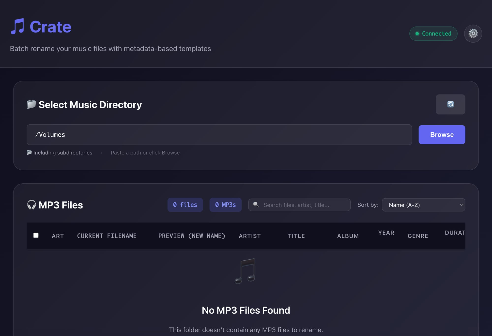
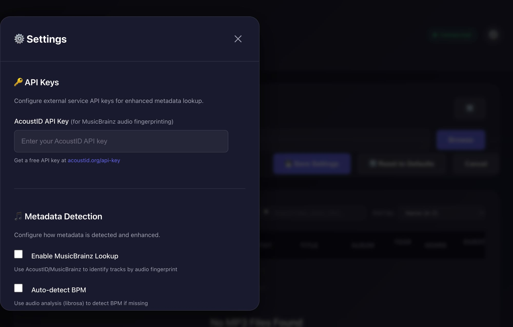

# 📦 Crate

**The DJ's Indestructible Library Tool**

[](https://github.com/zenone/crate)
[](https://python.org)
[](https://github.com/zenone/crate)
[](LICENSE)

A **DJ-first audio library tool** designed for real-world workflows:

- **Rekordbox** / **Pioneer CDJ-3000** / **XDJ gear**
- USB export + Finder browsing
- Long-term library hygiene and portability

**Crate** focuses on what actually matters to DJs:

- 🎵 **Smart Renaming** — Human-readable, scan-friendly filenames (`Artist - Title [8A 128]`)
- 📊 **Volume Normalization** — LUFS measurement and ReplayGain tagging
- 🎯 **Cue Detection** — Auto-detect drops, breakdowns, and export to Rekordbox
- 🔍 **Audio Analysis** — BPM/Key detection via Essentia or librosa

---

## ✨ Features

### Smart DJ-Friendly Filenames

```
Artist - Track Title (Extended Mix) [8A 128].mp3
01 Artist - Track Title.mp3
```

- **Artist - Title first** → fastest scanning on CDJs & USBs
- **Camelot Key + BPM** for instant mix context
- **Track numbers preserved** for albums/EPs

### Volume Normalization (NEW)

```bash
# Analyze loudness (no changes)
crate ~/Music/DJ --normalize

# Write ReplayGain tags
crate ~/Music/DJ --normalize --normalize-mode tag
```

- EBU R128 / LUFS measurement
- ReplayGain tag writing (non-destructive)
- Target: -14 LUFS (streaming standard)

### Cue Point Detection (NEW)

```bash
# Detect cues and export to Rekordbox
crate ~/Music/DJ --detect-cues --export-cues cues.xml
```

- **Intro detection** — First beat marker
- **Drop detection** — Energy peaks
- **Breakdown detection** — Energy dips
- **Rekordbox XML export** — Ready for import

### Deep Metadata Reading

- Standard ID3 frames (`TPE1`, `TIT2`, `TALB`, `TBPM`, `TKEY`)
- Rekordbox/Serato custom tags
- Fallback to filename parsing
- MusicBrainz/AcoustID lookup (optional)

---

## 🚀 Quick Start

### Install

```bash
git clone https://github.com/zenone/crate.git
cd crate
pip install -e .
```

### First Run (Preview Mode)

```bash
# Shows what WOULD change (no actual changes)
crate ~/Music/Incoming --dry-run -v
```

### Rename Files

```bash
crate ~/Music/Incoming
```

### Web Interface

```bash
./crate-web.sh --no-https
# Open http://127.0.0.1:8000
```

---

## 💻 Web Interface



The modern Web UI offers:

- **Directory Browser** — Navigate your filesystem
- **Live Preview** — See changes before applying
- **Dark Mode** — Because we're DJs
- **Undo** — One-click revert
- **Settings Panel** — Configure templates, metadata detection, and more



---

## 🎚️ CLI Reference

### Basic Usage

```bash
crate PATH [options]
```

### Renaming Options

| Option | Description |
|--------|-------------|
| `--dry-run` | Preview changes without applying |
| `--no-recursive` | Don't recurse into subfolders |
| `--template TEMPLATE` | Custom filename template |
| `--analyze` | Enable BPM/Key audio analysis |
| `-v, -vv` | Increase verbosity |

### Normalization Options

| Option | Description |
|--------|-------------|
| `--normalize` | Analyze/normalize volume levels |
| `--normalize-mode MODE` | `analyze`, `tag`, or `apply` |
| `--target-lufs LUFS` | Target loudness (default: -14.0) |

### Cue Detection Options

| Option | Description |
|--------|-------------|
| `--detect-cues` | Detect hot cue points |
| `--export-cues PATH` | Export to Rekordbox XML |
| `--cue-sensitivity N` | Detection sensitivity (0.0-1.0) |

### Examples

```bash
# Rename with BPM/Key analysis
crate ~/Music/NewTracks --analyze

# Normalize and write ReplayGain tags
crate ~/Music/DJ --normalize --normalize-mode tag

# Detect cues with high sensitivity
crate ~/Music/DJ --detect-cues --cue-sensitivity 0.8 --export-cues ~/Desktop/cues.xml
```

---

## 🛠️ Development

### Setup

```bash
make setup
source .venv/bin/activate
```

### Testing

```bash
make test          # Unit tests (fast)
make golden        # Integration tests with real MP3s
make verify        # Full quality gate (lint + test)
```

### Code Quality

```bash
make lint          # ruff + mypy
make format        # Auto-format with ruff
```

### Project Structure

```
crate/
├── crate/
│   ├── api/            # API layer
│   │   ├── renamer.py
│   │   ├── normalization.py  # NEW
│   │   └── cue_detection.py  # NEW
│   ├── cli/            # CLI interface
│   └── core/           # Business logic
│       ├── audio_analysis.py
│       ├── normalization.py  # NEW
│       └── cue_detection.py  # NEW
├── web/                # Web UI (FastAPI)
├── tests/              # Test suite (417+ tests)
└── docs/               # Documentation
```

---

## 📦 Installation Details

**Requirements:** Python 3.10+

```bash
pip install -e .
```

**Optional dependencies:**

| Package | Purpose | Install |
|---------|---------|---------|
| `chromaprint` | MusicBrainz fingerprinting | `brew install chromaprint` |
| `pyloudnorm` | LUFS measurement | Included |
| `essentia` | Fast BPM/Key detection | Included |

Full guide: [INSTALLATION.md](INSTALLATION.md)

---

## 🛡️ Philosophy

Crate is opinionated on purpose. It favors **Stability** over cleverness and **Human Readability** over database purity.

If your USB ever corrupts, Rekordbox breaks, or you switch platforms —  
**your library will still make sense.**

---

## 📋 Roadmap

- ✅ **Phase 1:** Volume Normalization (LUFS, ReplayGain)
- ✅ **Phase 2:** Basic Cue Detection (intro, drops, breakdowns)
- 📋 **Phase 3:** Advanced Phrase Detection (ML-based verse/chorus/drop)

---

## 👤 About

Built by [Steve Zenone](https://www.linkedin.com/in/zenone/).

---

## 🖤 Built for DJs who care about their libraries.
