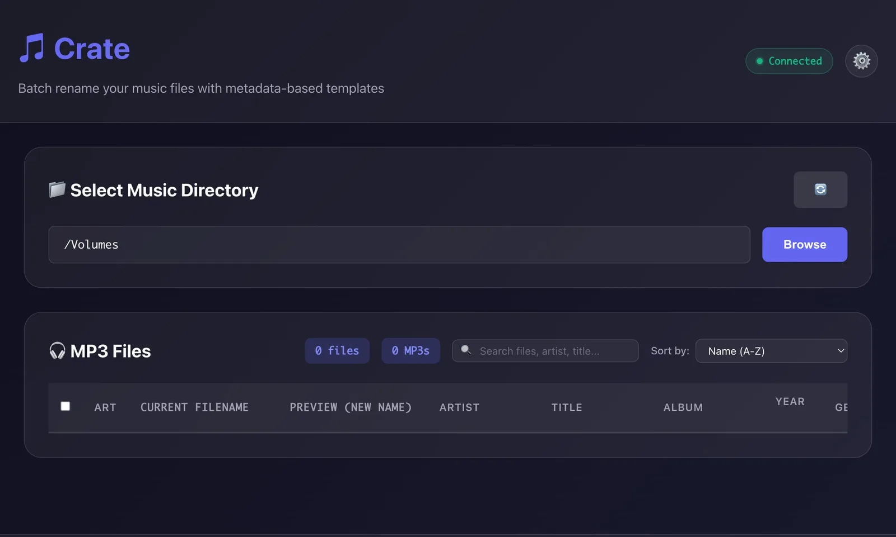
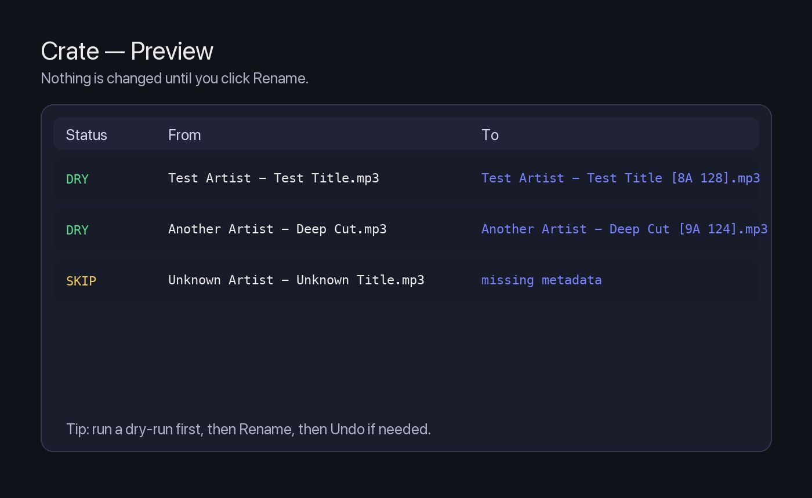
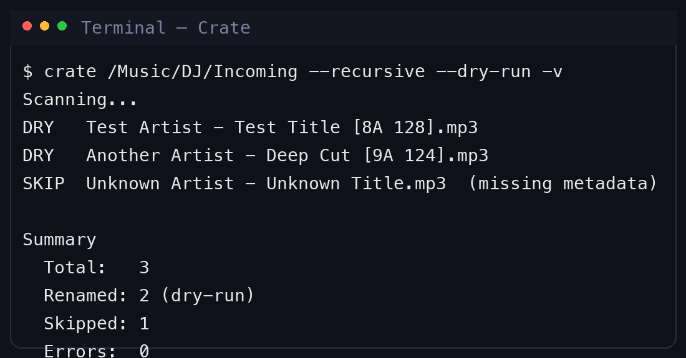

# 📦 Crate: The DJ's Indestructible Library Tool

A **DJ-first MP3 renaming and metadata cleanup tool** designed for real-world workflows using:

- **Rekordbox**
- **Pioneer CDJ-3000 / XDJ gear**
- USB export + Finder browsing
- Long-term library hygiene and portability

**Crate** focuses on what actually matters to DJs:

- Human-readable, scan-friendly filenames (`Artist - Title`)
- Clean, deterministic metadata
- Album/EP ordering that *never breaks*
- Optional MusicBrainz-style identification for poorly tagged files

---

## ✨ What Crate Does

### Screenshots

Web UI (directory picker + connected status):



Web UI (preview example):



CLI (dry-run preview):



### 1. Smart DJ-Friendly Filenames
Creates filenames like:

```
Artist - Track Title (Extended Mix) [8A 128].mp3
01 Artist - Track Title.mp3
```

Why this works:
- **Artist - Title first** → fastest scanning on CDJs & USBs
- Optional **Camelot Key + BPM** for instant context
- **Track numbers preserved** for albums/EPs

---

### 2. Deep Metadata Reading (ID3 Best Practices)

Reads metadata from **all common DJ tag variants**, including:
- Standard ID3 frames (`TPE1`, `TIT2`, `TALB`, `TBPM`, `TKEY`)
- Rekordbox/Serato custom tags
- Fallback to filename parsing if tags are missing

---

### 3. Album / EP Detection (Automatic)

When processing folders:
- If **all tracks share the same album tag**...
- And **most tracks have track numbers**...
➡️ Crate automatically treats the folder as an album and prefixes `01`, `02`...

---

## 📦 Installation

If you just want to use Crate locally (recommended):

```bash
pip install .
```

Notes:
- On macOS, the fastest audio analysis backend (Essentia) currently requires **Python 3.10–3.13**.
- See the full install guide: `INSTALLATION.md`.

(We’ll publish to PyPI once we’re ready.)

---

## 🚀 Usage

Non-technical? Start here: **`docs/GETTING_STARTED.md`**

### Basic Structure

```bash
crate PATH [options]
```

Where `PATH` is a file or folder.

---

## 🧪 SAFEST FIRST RUN (Highly Recommended)

### Dry run on a folder (no changes made)

```bash
crate ~/Music/Incoming --recursive --dry-run -v
```

What happens:
- Shows exactly what filenames *would* change
- No files renamed
- No metadata written

---

## 🎚️ Common Real-World Examples

### Example 1: Rename a single MP3

```bash
crate "Unknown Track.mp3"
```

### Example 2: Recursive folder processing (Label dumps)

```bash
crate ~/Music/NewTracks --recursive
```

### Example 3: Include Key & BPM in filenames (default)

```bash
crate ~/Music/NewTracks
# Output: Artist - Track Title [8A 128].mp3
```

> **Note on Speed:** By default, Crate runs in **Fast Mode** (reading existing ID3 tags only). This allows it to scan thousands of files in seconds.
>
> If your files are missing Key/BPM tags, use `--analyze` to enable **Deep Scan** (AI audio analysis). This reads the entire file and is slower but magical for untagged files.
> ```bash
> crate ~/Music/Untagged --analyze
> ```

---

## 💻 Web Interface

Prefer a visual experience? Crate comes with a modern Web UI.

```bash
python run_web.py
```
*Then open http://localhost:8000*

Features:
- **Drag & Drop** uploads
- **Dark Mode** (Supreme UX)
- **Live Preview** before renaming
- **Undo** functionality

API / integration:
- OpenAPI: http://localhost:8000/docs
- Human summary: `docs/API.md`

---

## ⚙️ All CLI Options

```text
usage: crate [-h] [--recursive] [--dry-run] [--workers WORKERS] [-l LOG] [-v] [--template TEMPLATE] path

positional arguments:
  path                  File or directory to process

optional arguments:
  -h, --help            show this help message and exit
  --recursive           Recurse into subfolders
  --dry-run             Show changes without applying them
  --workers WORKERS     Number of worker threads (default: 4)
  -l LOG, --log LOG     Write detailed log to a file
  -v, --verbosity       Increase verbosity (-v, -vv)
  --template TEMPLATE   Filename template. Default: '{artist} - {title}{mix_paren}{kb}'
```

---

## 👤 About

Built by Steve Zenone.

- LinkedIn: https://www.linkedin.com/in/zenone/

---

## 🛡️ Philosophy

Crate is opinionated on purpose. It favors **Stability** over cleverness and **Human Readability** over database purity.

If your USB ever corrupts, Rekordbox breaks, or you switch platforms —
**your library will still make sense.**

---

## 🖤 Built for DJs who care about their libraries.
